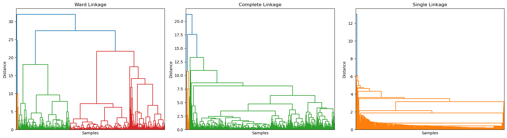
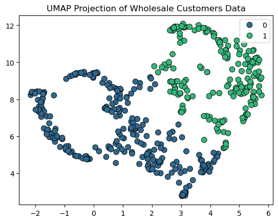

# Assignment Questions

## 1. Dataset Selection and Description

The dataset used in this study is the Wholesale Customers Dataset, obtained from the [UCI Machine Learning Repository](https://archive.ics.uci.edu/dataset/292/wholesale+customers). It contains information about 440 wholesale clients of a Portuguese distributor, with the goal of segmenting customers based on their annual spending patterns. The dataset includes eight attributes, of which six are continuous variables representing annual expenditures on different product categories, Fresh, Milk, Grocery, Frozen, Detergents_Paper, and Delicatessen and two are categorical variables, Channel (Horeca or Retail) and Region (Lisbon, Oporto, or Other). For the purpose of this analysis, the categorical variables were dropped, and only the continuous features were used. The data is clean, with no missing values. The continuous features were scaled using StandardScaler to ensure that all variables contribute equally to the analysis.

Clustering is suitable for this dataset because the primary objective is to group customers with similar purchasing behaviors without any predefined labels. By identifying natural groupings, businesses can better understand customer segments, tailor marketing strategies, and optimize inventory planning.

## 2. Cluster Analysis

### Hierarchical Clustering

The Agglomerative Hierarchical Clustering analysis on the dataset was conducted using various linkage methods to explore how distance metrics affect cluster formation. The dendrograms for Ward, Complete, and Single linkages reveal distinct hierarchical structures, with Ward linkage producing more balanced, compact clusters, while Single linkage exhibited the typical “chaining” effect, where points are sequentially linked based on minimal pairwise distances rather than overall group cohesion. Although the Single and Complete linkage methods achieved the highest silhouette score of 0.8638 for two clusters, this can be misleading, the high score reflects the presence of very tight subgroups and large inter-cluster gaps, not necessarily meaningful cluster compactness. In practice, such chaining can occur when a few customers have extreme spending behaviors that “bridge” between groups, artificially connecting distant observations into one elongated cluster. In contrast, the Ward linkage with a silhouette score of 0.7925 produced more interpretable clusters by minimizing within-cluster variance. Moreover, increasing the number of clusters to three reduced silhouette scores across all methods, suggesting that the data naturally forms two main customer groups with distinct purchasing patterns

{fig-align="center" width="100%"}

### K-Means Clustering

Building on the hierarchical clustering results, which showed that the data fits best into two clear clusters, K-Means was used to check if a centroid-based method could find a similar pattern. The results showed slightly better performance for three clusters (silhouette = 0.4583) than for two (silhouette = 0.3998), but both were much lower than the hierarchical scores. This suggests that K-Means could not capture the same strong separation found earlier, likely because customer spending patterns are irregular and not spherical in shape. In real terms, many customers share similar buying habits but differ in overall spending volume, causing overlap between groups.

### K-Means Clustering After PCA

To further improve clustering performance, Principal Component Analysis (PCA) was applied to reduce dimensionality while retaining around 85% of the explained variance within the first two components. After transforming the data, K-Means clustering was performed on the reduced features. The best result was achieved using two clusters with two principal components, giving a silhouette score of 0.6984, which is lower than the best hierarchical score but significantly higher than K-Means on the original data. This shows that PCA helped remove noise and redundant information, leading to better separation of customers in the reduced space. However, increasing the number of components or clusters did not further improve results, indicating that the main structure of the data can already be captured effectively by two components.

## 3. Clustering methods comparisions

The clustering analysis reveals notable differences between the methods. First, Agglomerative Clustering produces the most distinct and well-separated clusters, with ward linkage capturing the natural groupings of customers based on spending patterns. In contrast, KMeans shows more overlap between clusters, reflecting its reliance on centroids and the assumption of spherical clusters, which may not match the true distribution of the data. Second, comparing hierarchical clustering with PCA, the latter reduces cluster separation because projecting high-dimensional data into fewer dimensions can obscure subtle differences, whereas Agglomerative Clustering retains the full structure of the data. These comparisons indicate that hierarchical clustering best preserves natural groupings, while KMeans and PCA provide complementary perspectives that highlight global trends and finer variations in customer behavior.

## 4. UMAP Visualization and Discussion

Compared to Agglomerative Clustering, UMAP captures the overall separation of customers but produces slightly less compact clusters, with some points bridging groups. Its silhouette score of 0.4312 indicates moderate separation, reflecting local overlap caused by the nonlinear embedding. Overall, UMAP provides an intuitive visualization that aligns with hierarchical clustering while highlighting the dataset’s inherent structure and variability.

A comparison with the Channel variable shows that Cluster 0 mostly contains Channel 1 customers (248 out of 256) and Cluster 1 mostly contains Channel 2 customers (134 out of 184), suggesting that UMAP clusters roughly correspond to the Horeca vs. Retail segmentation while still capturing some cross-channel variability.

{fig-align="center" width="40%"}
